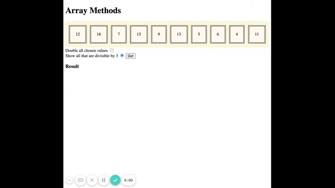

# array-methods

Given a collection of numbers, we can select up to five and perform an algorithm on those numbers. Our result will appear as an `h3` below the radio buttons.

---

## Getting started

To continue working on this repository from where we left off in coaching (Tuesday 18 May):

1. [Fork](https://docs.github.com/en/github/getting-started-with-github/fork-a-repo#fork-an-example-repository) this repository
1. Clone it to your local machine using `git clone`
1. Open your code editor
1. Follow steps three and four in `coaching.js`

To start working on this repository from scratch:

1. [Fork](https://docs.github.com/en/github/getting-started-with-github/fork-a-repo#fork-an-example-repository) this repository
1. Clone it to your local machine using `git clone`
1. Open your code editor
1. Follow the steps in `attempt.js`

**Note:** Be sure to check which JavaScript file you're pointing to in HTML. This challenge can be solved without modifying the HTML or CSS.

## Expected behaviour

